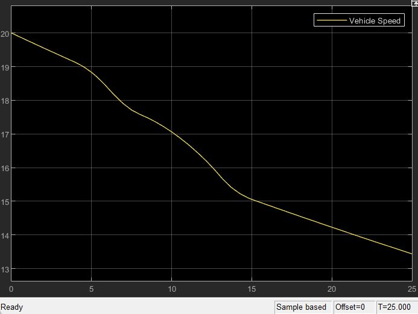
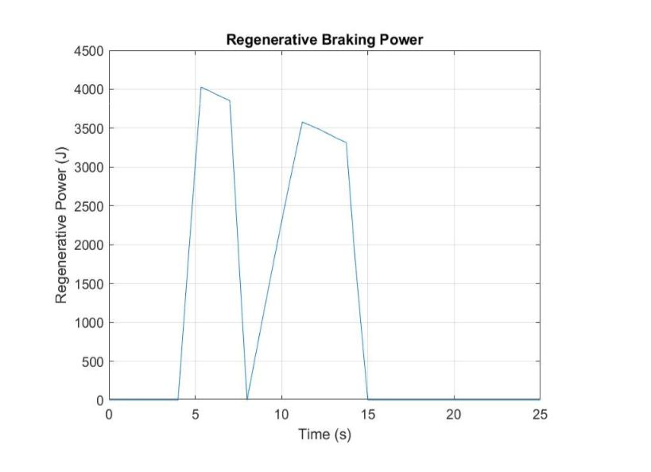
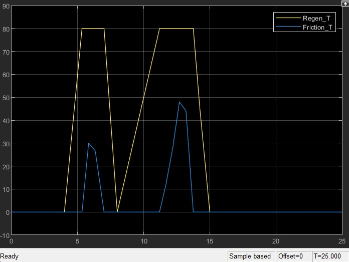

# Regenerative Braking System — EV Simulation (MATLAB/Simulink)

## Overview
A MATLAB/Simulink simulation of a regenerative braking system for an 
electric vehicle, analyzing braking torque distribution and kinetic 
energy recovery during deceleration events.

## Model Architecture
The model consists of five subsystems:

| Subsystem | Function |
|---|---|
| Driver Input | Brake demand signal profile |
| Regenerative Braking Controller | Splits torque into regen and friction |
| Motor/Generator | Converts mechanical to electrical power |
| Vehicle Dynamics | Computes vehicle speed response |
| Battery Model | Tracks recovered energy (J and kWh) |

## Control Logic
Speed-based regenerative braking strategy:

| Vehicle Speed | Braking Mode |
|---|---|
| < 5 m/s | Friction braking only |
| 5 – 15 m/s | Partial regenerative braking |
| > 15 m/s | Full regenerative braking |

## Vehicle Parameters
| Parameter | Value |
|---|---|
| Vehicle Mass | 1200 kg |
| Initial Speed | 20 m/s |
| Max Regen Torque | ~80 Nm |
| Battery Charging Efficiency | 95% |

## Results
| Metric | Value |
|---|---|
| Initial Kinetic Energy | 240 kJ |
| Recovered Electrical Energy | ~28,000 J (0.0078 kWh) |
| Regenerative Efficiency | ~11.6% |

## Key Observations
- Regenerative braking activates only above 5 m/s due to motor 
  efficiency limits at low speed
- Friction brakes supplement torque when regenerative limit (~80 Nm) 
  is reached
- Energy recovery occurs only during active braking events

## Plots

## Tools Used
- MATLAB / Simulink

## Author
Shashwat Sinha — Mechanical Engineering, Delhi Technological University
